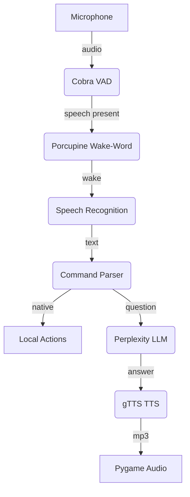

# 🤖 Jarvis – Personal Voice-Driven Assistant

Jarvis is a Python-based personal digital assistant (PDA) that listens for a wake-word, converts spoken commands to text, and responds with synthesized speech. It integrates **Picovoice** wake-word and voice-activity-detection (VAD) engines, **Google Speech Recognition**, **Perplexity AI** for conversational answers, and a lightweight music/news helper. The project is designed to run cross-platform and can be installed either with **conda** (`environment.yml`) or with **pip** (`requirements.txt`).

## 🚀 Quick Start

| Scenario | File to use | Command |
|----------|-------------|---------|
| Conda users (recommended for Linux/macOS) | `environment.yml` | `conda env create -f environment.yml` |
| Pip/virtualenv users | `requirements.txt` | `pip install -r requirements.txt` |

After dependency installation:

```bash
# Activate conda env
conda activate Jarvis         # if you used environment.yml

# OR activate your venv for pip installs

# Run Jarvis
python Jarvis.py
```

## 📋 Table of Contents
1. [Features](#features)
2. [Architecture](#architecture)
3. [Key Modules & APIs](#key-modules--apis)
4. [Configuration](#configuration)
5. [Logging](#logging)
6. [Roadmap](#roadmap)
7. [License](#license)

## ✨ Features

- 🎙️ **Wake-word detection** – "Jarvis" keyword via **Porcupine** engine  
- 🔊 **Voice-activity detection** – **Cobra** lets the program avoid false triggers in silent segments  
- 💬 **Speech-to-text** – Converts microphone input to text with **Google Web Speech API**  
- 🧠 **Natural-language responses** – Queries routed to **Perplexity.ai / OpenAI-compatible** endpoint for concise answers  
- 🗣️ **Text-to-speech** – **gTTS** generates MP3 replies that are streamed with **Pygame**  
- 📰 **News headlines** – Fetches top headlines through **NewsAPI**  
- 🎵 **Media shortcuts** – Quick "play …" commands map to URLs in `musicLibrary.py`  
- 💻 **Desktop automation** – Opens VS Code, Perplexity, Discord, WhatsApp or URLs (Google, YouTube, Google Keep) via `subprocess`/`webbrowser`  

## 🏗️ Architecture



*Micro-pipeline:* audio frames flow through VAD → wake-word → recognition → command handler.

## 🔧 Key Modules & APIs

| Module / Service | Purpose | Notes |
|------------------|---------|-------|
| **pvporcupine** | Offline wake-word spotting | Uses personal Access Key from Picovoice Console |
| **pvcobra** | Voice-activity detection | Filters non-speech frames to save CPU |
| **speech_recognition** | Speech-to-text wrapper | Leverages Google Web Speech API over HTTPS |
| **openai** (pointing to Perplexity) | Chat completions | Base URL set to `https://api.perplexity.ai` with `sonar-pro` model |
| **gTTS** | Text-to-Speech | Generates temporary `temp.mp3` files |
| **pygame.mixer** | Audio playback | Lightweight, cross-platform |
| **requests** | REST calls (NewsAPI, web queries) | Requires `NEWS` API key in `.env` |
| **dotenv** | Loads secret keys | `.env` should define `PICO`, `PPLX`, `NEWS` |
| **PvRecorder** | Low-latency audio capture | Matches Porcupine frame length |
| **subprocess / webbrowser** | Launches local apps & websites | Paths are currently Windows-specific (edit as needed) |

## ⚙️ Configuration

1. **Create `.env`** in the project root:

   ```dotenv
   PICO=picovoice_access_key
   PPLX=perplexity_api_key
   NEWS=newsapi_key
   ```

2. **Music library** 🎼  
   Add your own titles/URL pairs in `musicLibrary.py`:

   ```python
   music = {
       "lofi": "https://www.youtube.com/watch?v=5qap5aO4i9A",
       "rick roll": "https://youtu.be/dQw4w9WgXcQ",
   }
   ```

3. **Executable paths** 📁  
   `Jarvis.py` includes absolute paths for VS Code, Discord, etc. Update them for your OS.

4. **Sensitivity** 🎚️  
   Adjust `sensitivities=[0.4]` for Porcupine; lower means more sensitive.

## 📝 Logging

All user commands, AI responses, and exceptions are appended to `jarvis.log` with timestamps for debugging purposes.

## 🗺️ Roadmap

- ⚡ Replace **gTTS** with a real-time TTS engine for faster responses  
- 🌍 Cross-platform path handling (Windows, macOS, Linux)  
- 🖥️ GUI overlay to display transcription and status  
- 🔌 Plug-in system for new commands (smart-home control, calendar, email)  

## 📄 License

This repository is released under the MIT License. See `LICENSE` for details.

> *"Sometimes you gotta run before you can walk." — Tony Stark*